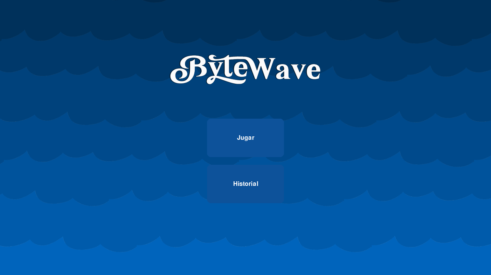
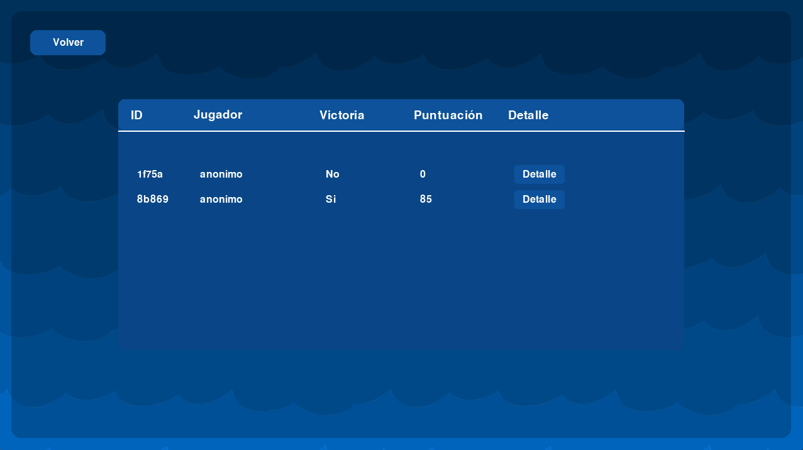
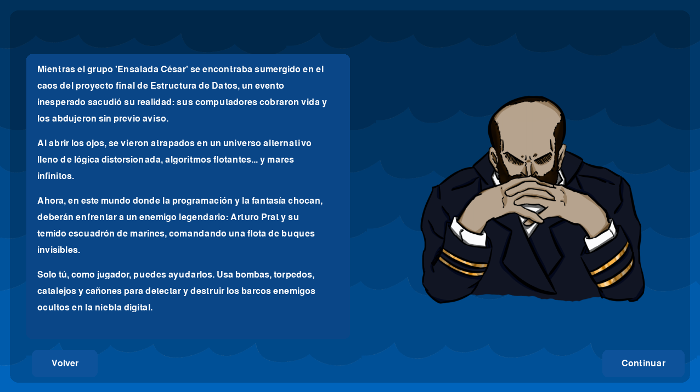
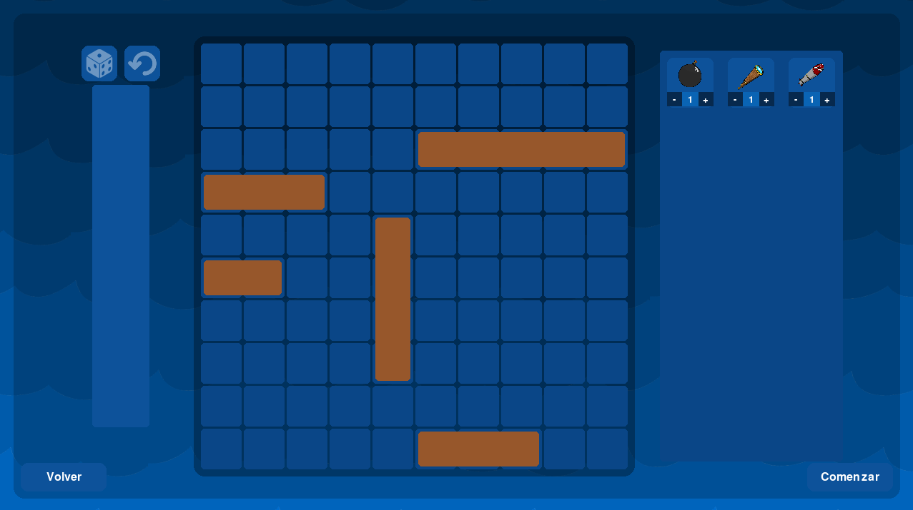
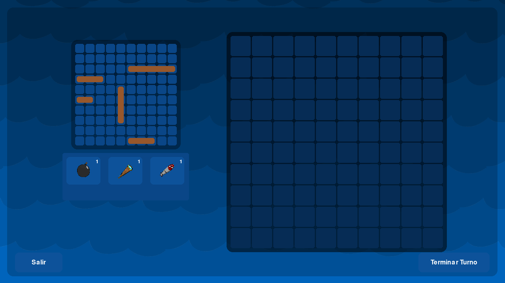
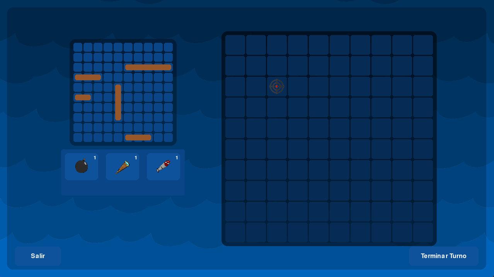
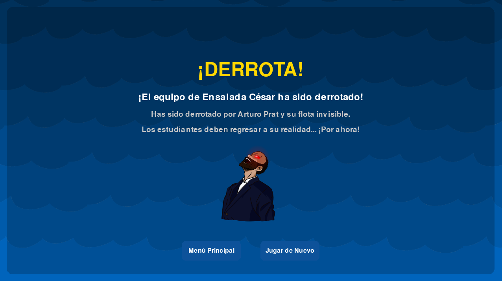

# ByteWave
---
## Embárcate en la batalla definitiva en ByteWave!

¿Estás listo para sumergirte en una guerra digital donde la lógica es tu única arma? ByteWave es un juego táctico por turnos que mezcla estrategia naval con un toque de locura informática. Enfrenta mares de código, enemigos invisibles y una narrativa tan absurda como épica.

### ¿Qué te espera en ByteWave?
Tú eres la última esperanza:
El grupo *Ensalada César* ha sido atrapado en una dimensión de datos corruptos y tú eres quien debe guiarlos. Cada disparo cuenta, cada decisión puede cambiar el rumbo de la batalla.

Guerra digital estratégica:
Enfréntate a la flota espectral de *Arturo Prat* en partidas de estilo Battleship con una vuelta de tuerca: deberás usar lógica, memoria y visión espacial para encontrar y destruir buques escondidos entre bits.

Objetos especiales:
Desbloquea y usa bombas, torpedos, catalejos y cañones para mejorar tu puntería y superar a los marines fantasmas que amenazan con formatear tu existencia.

¿Tienes lo que se necesita para decodificar el misterio, liderar al escuadrón y regresar al mundo real?
**ByteWave** no es solo un juego, es una misión desesperada por la supervivencia digital.

¿Te atreves a enfrentarlo?

---
## Cómo compilar y ejecutar

Este sistema ha sido desarrollado en lenguaje C, con una interfaz grafica en Python y puede ejecutarse fácilmente utilizando **Visual Studio Code** junto con una extensión para C/C++, como **C/C++ Extension Pack** de Microsoft. Para comenzar a trabajar con el sistema en tu equipo local, sigue estos pasos:
---
### Requisitos previos:

- Tener instalado [Visual Studio Code](https://code.visualstudio.com/).
- Instalar la extensión **C/C++** (Microsoft).
- Tener instalado un compilador de C (como **gcc**). Si estás en Windows, se recomienda instalar [MinGW](https://www.mingw-w64.org/) o utilizar el entorno [WSL](https://learn.microsoft.com/en-us/windows/wsl/).

- Tener instalado [Python](https://www.python.org/).
- Instalar la extensión **Python**
- Ejecutar el siguiente comando en la consola para importar **pygame**
  ```
  $ pip install pygame
  ```

---
### Pasos para compilar y ejecutar:

- Descarga y descomprime el archivo .zip en una carpeta de tu elección.
- Abre el proyecto en Visual Studio Code
- Inicia Visual Studio Code.
    Selecciona **Archivo > Abrir carpeta...** y elige la carpeta donde descomprimiste el proyecto.
- Compila el código
    Abre el archivo principal (**main.c**).
    Abre la terminal integrada (**Terminal > Nueva terminal**).
    En la terminal, ejecuta el programa con el siguiente comando:
        ```
        python game.py
        ```
---
## Funcionalidades

### Inicio de Partida:

- Carga la configuración del tablero del jugador y la disposición de barcos desde un archivo.
- Genera aleatoriamente el tablero del bot, replicando el tamaño y la cantidad de barcos del jugador.
- Asigna objetos especiales al jugador según la configuración del archivo.

### Turnos de Juego:

El jugador puede realizar múltiples acciones por turno.

*Las acciones incluyen ataques a coordenadas específicas o el uso de objetos especiales.*

### Ataques:

- El jugador especifica las coordenadas (X, Y) para atacar el tablero del bot.
- El juego informa si el ataque fue "agua" (miss) o "impacto" (hit) a un barco.
- Las celdas atacadas se marcan en el tablero del bot para evitar ataques repetidos en la misma posición.

### Uso de Objetos:

Los objetos especiales proporcionan habilidades únicas para el ataque o reconocimiento:

- Bomba (ID: 1): Ataca un área de 3x3 celdas alrededor de una coordenada central.
- Catalejo (ID: 2): Revela el estado (barco o agua) de una celda específica en el tablero del bot sin atacar.
- Torpedo (ID: 3): Ataca una línea completa (horizontal o vertical) desde una coordenada inicial.

### Historial de Partida:

- Todos los movimientos del jugador (ataques y uso de objetos) se registran en un archivo cache.
- Es posible consultar el historial de movimientos de una partida anterior usando su ID.

### Estado de Partida:

- Después de cada turno, se muestran mensajes de estado (informes de casillas atacadas).
- El juego verifica continuamente si todos los barcos del bot han sido hundidos para determinar el fin de la partida.


### Funcionando correctamente:

- Menú Principal.
- Historial de Partidas.
- Jugabilidad General.
- Funcionalidad de los Objetos.
- Funcionalidad General de la Interfaz.
- Funcionalidad de Victoria y Derrota.
- Funcionalidad del Bot Automatizado.

### Problemas conocidos:

- Seleccionar más de un objeto puede generar desfase a la hora de ejecutar un disparo.

### A mejorar:

- Se podría agregar distintas dificultades para el bot o *misiones secundarias*, de esta forma haria un juego mas dinamico, no tan monotono. 

## Ejemplo de uso

**1) Menú Principal**



Dentro de este menú podemos encontrar dos botones en el centro, uno que nos lleva hasta el registro de *historial* y otro que nos lleva a la partida (*jugar*)

**2) Historial**



Dentro de este apartado podemos encontrar (en caso de haber jugado antes) la lista de partidas junto a sus respectivos puntajes.

**3) Jugar**



Antes de empezar a posicionar nuestros barcos vemos la historia del juego en el que nos sometemos.

**3.1) Seleccion de Barcos**



Dentro de este apartado podemos seleccionar las posiciones de los barcos, rotando sus posiciones con la tecla *"r"*. Tambien podemos elegir la cantidad de objetos que queremos.

*Consideracion Importante: El bot tendrá la misma cantidad de botes que el jugador.*

**3.2) Dentro de la partida**



Dentro de esta pantalla podemos observar la cantidad de objetos que poseemos, nuestro tablero arriba a la izquierda y en grande el tablero del bot. Podemos seleccionar casillas con el mouse y confirmar el disparo con la tecla *espacio* o con el boton *"Terminar Turno"*.



**3.3) Objetos**

Para usar un objeto basta con seleccionarlos con el mouse, de esta forma al pasar el raton por encima de el objeto, el juego mostrará un cuadro de texto explicando el funcionamiento de el objeto.


*Objetos Disponibles: Bomba, Catalejo, Torpedo.*

**4) Definicion de partida**

Al concluir la partida podremos encontrar distintas pantallas de finalización, dependiendo de el resultado de la partida, junto con dos botones, uno que nos lleva al *menú principal* y otro que nos propone *jugar de nuevo*.



## Contribuciones
---
### Anais Diaz
- Lógica del bot.
- Elaboración Canva Presentación.
- 
---
### Cristian Gallardo
- Elaboración del Historial.
- Elaboración Canva Presentación.
- 
---
### Daniel Gajardo
- Interaccion Grafica.
- Estrategia de Comunicacion entre Lenguajes.
- Corrección de Errores General. 
---
### Matías Salas
- Gestion de Objetos.
- Selección de TDAS.
- Diseño Grafico y Creativo.
- Elaboración del Readme.
---
